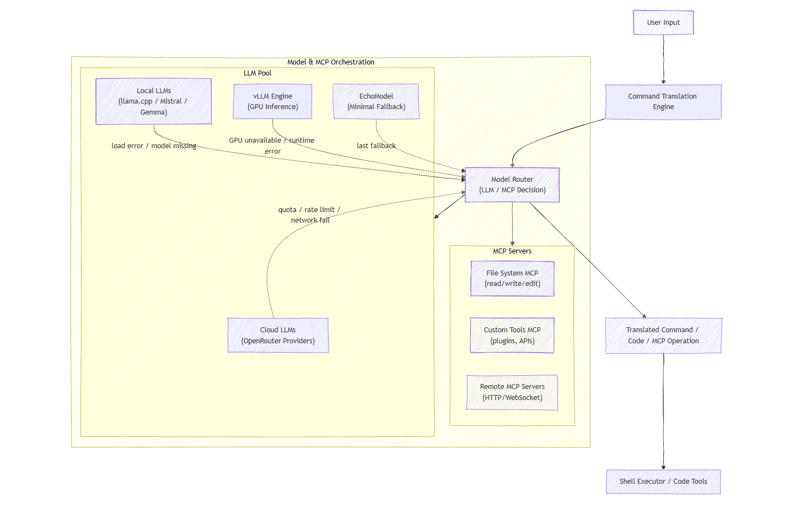

# Joshu

AI-powered command-line assistant that converts natural language into shell commands and code.



## Installation

```bash
git clone https://github.com/Faycacalraghibi/joshu-assistant.git
cd joshu-assistant
pip install -e .
```

**Optional dependencies:**
```bash
pip install -e .[semantic]  # Semantic memory
pip install -e .[llm]       # Local models
pip install -e .[dev]       # Development tools
```

## Quick Start

```bash
joshu interactive              # Start interactive mode
joshu "your command here"      # One-shot execution
joshu search "query"           # Search the web for information
```

## Documentation

See [`docs/`](docs/) for complete documentation:

- **[Enhanced Interactive Mode](docs/enhanced_interactive_mode.md)** — Features and commands
- **[Web Search](docs/web-search.md)** — Search the web from your terminal
- **[VLLM Server Integration](docs/VLLM_SERVER_INTEGRATION.md)** — Local model setup
- **[Rules & Guidelines](docs/Rules.md)** — Development standards
- **[Todo](docs/Todo.md)** — Roadmap and planned features

## Configuration

Create `~/.joshu/config.yaml` or set environment variables. See [docs](docs/) for details.

## License

MIT — See [LICENSE](LICENSE)
