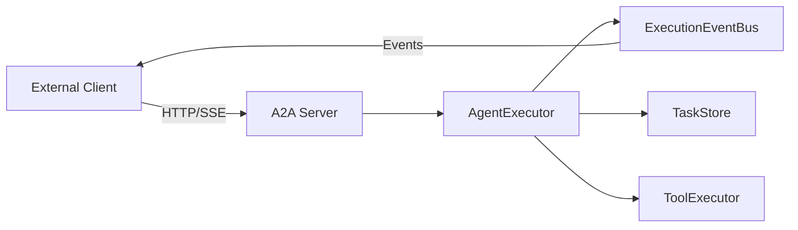
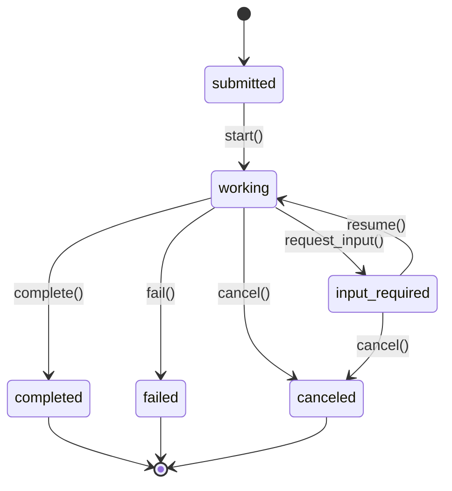

# A2A Server (Agent-to-Agent Communication)

The A2A server provides HTTP-based access to Joshu's agent capabilities, enabling external clients (IDEs, UIs, SDKs) to communicate with the agent via a REST API with Server-Sent Events (SSE) streaming.

Each task runs Joshu's tool-using agent (the same one as `joshu run`): it reads
and edits files and runs commands in the task's target directory, streaming
its progress as events. Tool calls that need approval become confirmation
requests the client answers.

## Quick Start

### Install Dependencies

```bash
pip install -e .[a2a]
```

### Start the Server

```bash
joshu serve                      # http://127.0.0.1:8080, prints the bearer token
joshu serve --port 9000
JOSHU_A2A_TOKEN=my-token joshu serve   # use your own token
```

Every endpoint except `/health` and the agent card needs
`Authorization: Bearer <token>`. The model and provider come from your Joshu
configuration (see [Models & Providers](models-and-providers.md)).

### Creating Your First Task

```bash
# Create a task
curl -X POST http://localhost:8080/tasks \
  -H "Authorization: Bearer $TOKEN" -H "Content-Type: application/json" \
  -d '{"message": "List the Python files here", "target_directory": "/path/to/project"}'

# Stream events (replace TASK_ID)
curl -N -H "Authorization: Bearer $TOKEN" http://localhost:8080/tasks/{TASK_ID}/stream
```

## Architecture Overview



### Core Components

| Component | Purpose |
|-----------|---------|
| `A2AServer` | FastAPI HTTP server with CORS, SSE streaming |
| `AgentExecutor` | Orchestrates task lifecycle, bridges to existing components |
| `Task` | State container wrapping `ChatSession` + `CoreToolScheduler` |
| `TaskStore` | Persistence layer (InMemory, File, NoOp) |
| `ExecutionEventBus` | Pub/sub for streaming events to clients |
| `CommandRegistry` | Maps CLI commands to executable handlers |

## Task Lifecycle

Tasks follow this state machine:



### Task States

| State | Description |
|-------|-------------|
| `submitted` | Task created, awaiting execution |
| `working` | Task is actively executing |
| `input-required` | Awaiting user confirmation for tool execution |
| `completed` | Task finished successfully |
| `failed` | Task encountered an error |
| `canceled` | Task was canceled by user |

## HTTP API Reference

### Task Endpoints

#### Create Task
```http
POST /tasks
Content-Type: application/json

{
    "message": "Initial user message",
    "model": "optional-model-name",
    "target_directory": "/optional/working/dir",
    "tools_enabled": true,
    "approval_mode": "safe_only"
}
```

`approval_mode`: `safe_only` (default: edits, commands and other risky tools
need a confirmation), `accept_edits`, `plan` (read-only) or `bypass`.
Commands flagged as unsafe always need a confirmation. Confirmation options are
`proceed_once`, `proceed_session` (stop asking for this tool), `cancel` and
`cancel_task`.

While a task runs, text the model writes before using a tool is streamed as a
`thought` event, tool calls as `tool_call` events (status `executing`, then
`completed` or `failed` with the result), and the final answer as a `message`
event followed by `complete`.

Response:
```json
{
    "task_id": "abc123",
    "state": "submitted",
    "created_at": "2024-01-01T00:00:00Z"
}
```

#### Stream Task Events (SSE)
```http
GET /tasks/{task_id}/stream
Accept: text/event-stream
```

Starts execution if task is in `submitted` state. Returns Server-Sent Events until terminal state.

#### Get Task Metadata
```http
GET /tasks/{task_id}
```

#### List All Tasks
```http
GET /tasks/metadata
```

#### Cancel Task
```http
POST /tasks/{task_id}/cancel
Content-Type: application/json

{
    "reason": "Canceled by user"
}
```

#### Respond to Confirmation
```http
POST /tasks/{task_id}/confirm
Content-Type: application/json

{
    "call_id": "tool-call-id",
    "response": "proceed_once"  // or "cancel", "cancel_task"
}
```

### Command Endpoints

#### Execute Command
```http
POST /executeCommand
Content-Type: application/json

{
    "command": "init",
    "args": {},
    "workspace_path": "/path/to/project"
}
```

Returns SSE stream with command execution events.

#### List Available Commands
```http
GET /listCommands
```

Returns:
```json
[
    {
        "name": "init",
        "description": "Initialize project with GEMINI.md descriptor",
        "arguments": [...],
        "subcommands": []
    },
    {
        "name": "restore",
        "description": "Restore from a checkpoint",
        "arguments": [...],
        "subcommands": [{"name": "list", "description": "List available checkpoints"}]
    }
]
```

### Agent Card
```http
GET /.well-known/agent-card.json
GET /agent-card.json
```

Returns agent metadata and capabilities.

### Health Check
```http
GET /health
```

Returns:
```json
{"status": "healthy", "service": "joshu-a2a"}
```

## Event Types

Events are streamed via SSE with the following types:

| Event Type | Description |
|------------|-------------|
| `thought` | Agent's internal reasoning |
| `tool_call` | Tool invocation request |
| `tool_result` | Tool execution result |
| `confirmation_request` | Approval needed for tool |
| `confirmation_response` | User response to confirmation |
| `state_change` | Task state transition |
| `message` | Agent text response |
| `error` | Error occurred |
| `complete` | Task completed |

### Event Format

```json
{
    "event_type": "tool_call",
    "data": {
        "tool_name": "web_search",
        "arguments": {"query": "example"},
        "call_id": "call-123",
        "status": "pending"
    },
    "task_id": "task-abc",
    "timestamp": "2024-01-01T00:00:00Z",
    "sequence": 1
}
```

## Confirmation Flow

When a tool requires user approval:

1. Server emits `confirmation_request` event
2. Task transitions to `input-required` state
3. Client calls `POST /tasks/{id}/confirm` with response
4. Task resumes based on response:
   - `proceed_once`: Execute tool, continue task
   - `cancel`: Skip tool, continue task
   - `cancel_task`: Cancel entire task

### Confirmation Options

| Option | Description |
|--------|-------------|
| `proceed_once` | Execute this tool only |
| `proceed_session` | Auto-approve similar tools for session |
| `cancel` | Skip this tool call |
| `cancel_task` | Cancel the entire task |

## Task Storage

Three storage implementations are available:

### InMemoryTaskStore
```python
from joshu.a2a import InMemoryTaskStore, set_task_store

set_task_store(InMemoryTaskStore())
```
Best for: Development, testing, ephemeral sessions.

### FileTaskStore
```python
from joshu.a2a.task_store import FileTaskStore
from pathlib import Path

store = FileTaskStore(Path("./task_data"))
set_task_store(store)

# Save workspace for a task
store.save_workspace("task-123", Path("./workspace"))

# Restore workspace
store.restore_workspace("task-123", Path("./restored"))
```

Features:
- Gzipped JSON metadata (`metadata.json.gz`)
- Workspace archival as tarballs (`workspace.tar.gz`)
- Path traversal protection via regex validation

### NoOpTaskStore
```python
from joshu.a2a import NoOpTaskStore, set_task_store

set_task_store(NoOpTaskStore())
```
Best for: When persistence is handled externally.

## Command Registry

Commands are registered for CLI-to-server bridging:

```python
from joshu.a2a.commands import get_command_registry

registry = get_command_registry()

# List available commands
for cmd in registry.get_all():
    print(f"{cmd.name}: {cmd.description}")

# Get specific command (supports dotted notation for subcommands)
init_cmd = registry.get("init")
list_checkpoints = registry.get("restore.list")
```

### Built-in Commands

| Command | Description |
|---------|-------------|
| `init` | Initialize project with GEMINI.md |
| `restore` | Restore from checkpoint |
| `restore.list` | List available checkpoints |
| `extensions` | Extension management |
| `extensions.list` | List installed extensions |

## Usage Examples

### Python Client

```python
import httpx
import json

# Create a task
response = httpx.post("http://localhost:8080/tasks", json={
    "message": "Create a simple hello world function"
})
task = response.json()
task_id = task["task_id"]

# Stream events
with httpx.stream("GET", f"http://localhost:8080/tasks/{task_id}/stream") as r:
    for line in r.iter_lines():
        if line.startswith("data: "):
            event = json.loads(line[6:])
            print(f"[{event['event_type']}] {event['data']}")
```

### JavaScript/TypeScript Client

```typescript
const eventSource = new EventSource(`/tasks/${taskId}/stream`);

eventSource.addEventListener("thought", (e) => {
    const event = JSON.parse(e.data);
    console.log("Agent thinking:", event.data.content);
});

eventSource.addEventListener("tool_call", (e) => {
    const event = JSON.parse(e.data);
    console.log("Tool called:", event.data.tool_name);
});

eventSource.addEventListener("complete", (e) => {
    eventSource.close();
});
```

### Execute Command

```python
import httpx

# Execute init command
with httpx.stream("POST", "http://localhost:8080/executeCommand", json={
    "command": "init",
    "args": {},
    "workspace_path": "./my-project"
}) as r:
    for line in r.iter_lines():
        if line.startswith("data: "):
            print(json.loads(line[6:]))
```

## Security Considerations

- **Task ID Validation**: Task IDs are validated against `^[a-zA-Z0-9_-]+$` to prevent path traversal
- **Bearer token**: required on every endpoint except `/health` and the agent card; `joshu serve` generates one unless `JOSHU_A2A_TOKEN` is set
- **CORS**: off by default, so web pages can't call the server; allow specific origins with `JOSHU_A2A_CORS_ORIGINS` (comma-separated)
- **Local by default**: `joshu serve` listens on 127.0.0.1; binding elsewhere lets anyone with the token run tasks on this machine
- **One target directory at a time**: file and shell tools resolve paths from process-wide settings, so run concurrent tasks for different directories in separate servers
- **No Silent Bypass**: Tool confirmations cannot be bypassed programmatically
- **Workspace Archives**: Tarball extraction filters out unsafe paths

## Testing

Run A2A tests:

```bash
pytest tests/a2a/ -v
```

Test coverage (94 tests):

| Test File | Coverage |
|-----------|----------|
| `test_events.py` | Event serialization, SSE formatting |
| `test_task.py` | Task lifecycle, state transitions |
| `test_task_store.py` | InMemory/NoOp storage |
| `test_file_store.py` | File-based persistence, path traversal prevention |
| `test_command_registry.py` | Command registration, subcommand support |

## Related Documentation

- [Agent Tools](agent.md#tools) - Tool execution framework
- [Chat & Scheduling](chat-and-scheduling.md) - Session and scheduler details
- [Command Processing](command-processing.md) - CLI command system
- [MCP Servers](mcp-servers.md) - External tool integration
