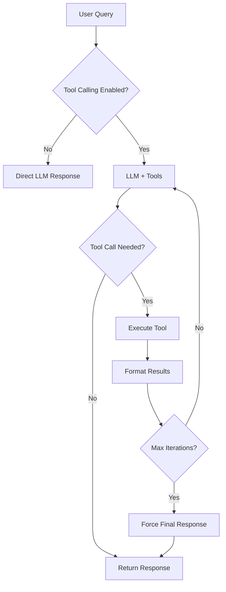

# Tool Calling Guide

## Overview

Tool calling enables Joshu to automatically invoke external tools (like web search) during conversations when it needs additional information beyond its training data. The LLM decides when to use tools and Joshu executes them automatically, providing enhanced responses with real-time information.

## Quick Start

### Basic Usage

Tool calling is enabled by default. Simply ask questions that require external information:

```bash
# In interactive mode
joshu --interactive

# Ask a question requiring current information
> What are the latest features in Python 3.13?
```

The agent will automatically:
1. Recognize it needs current information
2. Invoke the web search tool
3. Process the results
4. Provide an informed answer

### Direct API Usage

```python
from joshu.core.tool_calling_helper import chat_with_tools
from joshu.models.openrouter import chat_completion

messages = [
    {"role": "system", "content": "You are a helpful assistant."},
    {"role": "user", "content": "What's the weather in Paris?"}
]

response = chat_with_tools(
    messages=messages,
    chat_completion_func=chat_completion,
    model="openai/gpt-4o-mini",
    max_iterations=3
)

print(response["content"])
```

## Configuration

### Available Settings

Add these to your `config/config.yaml`:

```yaml
# Tool calling settings
tool_calling_enabled: true           # Enable/disable tool calling globally
tool_calling_max_iterations: 3       # Max tool call loops per query
web_search_tool_enabled: true        # Enable web search tool

# Web search settings (already configured)
web_search_enabled: true
web_search_max_results: 5
web_search_timeout: 10
```

### Enable/Disable Tool Calling

**Disable globally:**
```bash
joshu config --set tool_calling_enabled=false
```

**Disable just web search tool:**
```bash
joshu config --set web_search_tool_enabled=false
```

**Adjust max iterations:**
```bash
joshu config --set tool_calling_max_iterations=5
```

## Available Tools

### Web Search

**Automatically invoked when:**
- Asking about current events
- Requesting latest information
- Querying for documentation
- Looking up facts beyond training data

**Example questions:**
```
What are the latest Python releases?
How do I fix git merge conflicts?
What's new in React 19?
Search for FastAPI best practices
```

### Web Fetch

**Automatically invoked when:**
- User provides a specific URL
- Asking to read or summarize a webpage
- Extracting information from a website
- Comparing content from multiple URLs

**Security:** Requires user approval before accessing any URL.

**Example questions:**
```
Summarize the content at https://example.com/article
What does this page say about X? [url]
Read the documentation at https://docs.python.org
```

### Future Tools (Coming Soon)

- File operations (read/write files)
- Code execution (run and test code)
- Shell commands (with user approval)

## Creating Custom Tools

### Step 1: Define Your Tool

Create a new file in `src/joshu/tools/implementations/`:

```python
from joshu.core.tool_registry import register_tool

@register_tool(
    name="get_weather",
    description="Get current weather information for a location. Use this when the user asks about weather, temperature, or conditions.",
    parameters={
        "type": "object",
        "properties": {
            "location": {
                "type": "string",
                "description": "City name or location"
            },
            "units": {
                "type": "string",
                "description": "Temperature units (celsius or fahrenheit)",
                "enum": ["celsius", "fahrenheit"],
                "default": "celsius"
            }
        },
        "required": ["location"]
    },
    enabled=True,
    requires_approval=False
)
def get_weather_tool(location: str, units: str = "celsius") -> dict:
    """
    Get weather for a location.

    Returns a dictionary that will be formatted for the LLM.
    """
    # Your implementation here
    # Example: call weather API
    return {
        "success": True,
        "location": location,
        "temperature": 72,
        "condition": "sunny",
        "units": units
    }
```

### Step 2: Import Your Tool

Add to `src/joshu/tools/implementations/__init__.py`:

```python
from joshu.tools.implementations.weather_tool import get_weather_tool

__all__ = ["web_search_tool", "get_weather_tool"]
```

### Step 3: Test Your Tool

```python
from joshu.core.tool_executor import get_tool_executor

executor = get_tool_executor()
result = executor.execute_tool(
    "get_weather",
    {"location": "Paris", "units": "celsius"}
)

print(result)
```

## Advanced Usage

### Tool Specification Schema

Tools use JSON Schema for parameter definitions:

```python
parameters = {
    "type": "object",
    "properties": {
        "param_name": {
            "type": "string|integer|boolean|array|object",
            "description": "Clear description for LLM",
            "enum": ["option1", "option2"],  # Optional
            "default": "default_value"        # Optional
        }
    },
    "required": ["param1", "param2"]  # Required parameters
}
```

### Tool Approval

For sensitive tools (file writes, shell commands), set `requires_approval=True`:

```python
@register_tool(
    name="delete_file",
    description="Delete a file (requires user confirmation)",
    parameters={...},
    requires_approval=True  # User must approve before execution
)
def delete_file_tool(filepath: str) -> dict:
    # Tool implementation
    pass
```

### Error Handling

Tools should return dictionaries indicating success/failure:

```python
def my_tool(arg: str) -> dict:
    try:
        result = do_something(arg)
        return {
            "success": True,
            "data": result
        }
    except Exception as e:
        return {
            "success": False,
            "error": str(e)
        }
```

## How It Works

### Tool Calling Flow



### Iteration Limiting

To prevent infinite loops, tool calling is limited by `tool_calling_max_iterations` (default: 3):

1. **Iteration 1:** LLM calls tool → execute → return results
2. **Iteration 2:** LLM may call more tools if needed
3. **Iteration 3:** Final iteration
4. **After max:** LLM forced to give final answer

## Troubleshooting

### Tool Not Being Called

**Check:**
1. Tool calling is enabled: `tool_calling_enabled: true`
2. Specific tool is enabled: `web_search_tool_enabled: true`
3. Question requires external info (LLM decides when to use tools)

**Enable debug logging:**
```python
import logging
logging.basicConfig(level=logging.INFO)
```

### Cost Considerations

Tool calling adds API tokens:
- Tool specifications sent with each request (~200-500 tokens)
- Tool results sent back to LLM (varies by tool)

**To reduce costs:**
```yaml
tool_calling_enabled: false  # Disable globally
# OR
tool_calling_max_iterations: 1  # Limit to single tool call
```

### Tool Execution Failures

Check logs for details:
```bash
joshu config --set log_level=DEBUG
```

Common issues:
- Missing dependencies (install `ddgs` for web search)
- Network timeouts (increase `web_search_timeout`)
- Invalid parameters (check tool specification)

## Best Practices

### 1. Descriptive Tool Names

✅ Good: `web_search`, `get_weather`, `read_file`
❌ Bad: `tool1`, `search`, `get`

### 2. Clear Descriptions

Help the LLM understand when to use your tool:

```python
description="""Get current weather information for any location.
Use this when the user asks about:
- Current temperature or conditions
- Weather forecasts
- Climate information

Do NOT use for historical weather data."""
```

### 3. Helpful Parameter Descriptions

```python
"location": {
    "type": "string",
    "description": "City name or location (e.g., 'Paris', 'New York, NY', 'Tokyo, Japan')"
}
```

### 4. Return Structured Data

```python
return {
    "success": True,
    "data": {
        "temperature": 72,
        "condition": "sunny",
        "humidity": 45
    },
    "formatted_response": "It's 72°F and sunny in Paris"
}
```

## Examples

### Example 1: Current Events

```bash
> What happened in the latest SpaceX launch?
```
→ Automatically searches web → Returns current information

### Example 2: Documentation Lookup

```bash
> How do I use async/await in Python?
```
→ May search for latest docs → Provides accurate answer

### Example 3: Multiple Tool Calls

```bash
> Compare the weather in Paris and London
```
→ May call weather tool twice → Provides comparison

## See Also

- [Web Search Guide](web-search.md) - Detailed web search documentation
- [Web Fetch Guide](web-fetch.md) - Fetch and process URL content
- [Configuration Guide](configuration.md) - All configuration options
- [API Reference](../examples/tool_calling_example.py) - Code examples
